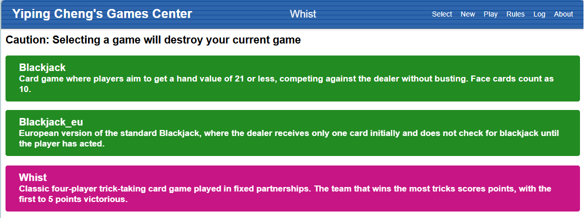
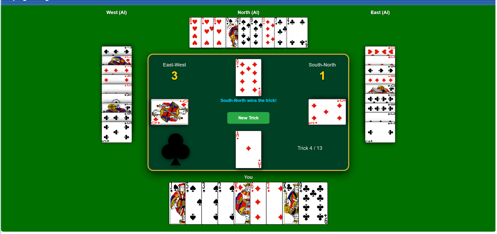

# Whist 纸牌游戏

这是一个基于 Flask 开发的网页版 Whist 纸牌游戏。玩家坐在 South 位置，与 North 组成一队，对抗 East 和 West 两名 AI 玩家。

项目重点是实现 Whist 的核心玩法：发牌、跟牌规则、将牌、赢墩判断、队伍计分和基础 AI 出牌。

## 游戏截图

### 游戏界面

请将游戏界面截图放到：

```text
assets/showcase/interface.png
```

README 会自动显示：



### 游玩过程

请将游玩过程截图放到：

```text
assets/showcase/playing.png
```

README 会自动显示：



## 功能特点

- 支持 4 人 Whist 对局：North、East、South、West。
- 玩家控制 South。
- North 是玩家的 AI 队友。
- East 和 West 是 AI 对手。
- 使用标准 52 张扑克牌，每名玩家 13 张。
- 根据最后一张发出的牌确定将牌花色。
- 支持 Whist 的跟牌规则：有同花色必须跟同花色。
- 自动判断每一墩的赢家。
- 自动统计 South-North 与 East-West 两队分数。
- 使用 SVG 扑克牌素材渲染牌面。
- 使用 Flask Session 保存当前游戏状态。

## 技术栈

- Python
- Flask
- Jinja2 模板
- JavaScript
- CSS
- SVG 扑克牌素材

## 项目结构

```text
whist-games-center/
├── flask_app.py              # Flask 应用入口和路由
├── whist.py                  # Whist 核心游戏逻辑
├── playcard.py               # 扑克牌生成和牌面工具函数
├── requirements.txt          # Python 依赖
├── vercel.json               # Vercel 部署配置
├── templates/
│   ├── base.html             # 页面基础模板
│   ├── select.html           # 游戏选择页
│   ├── whist.html            # Whist 游戏页面
│   └── rules.html            # 规则说明页
├── static/
│   ├── whist.css             # Whist 页面样式
│   ├── whist.js              # 前端选牌和操作逻辑
│   └── svg-cards.svg         # SVG 扑克牌素材
└── assets/
    └── showcase/             # README 展示截图
```

## 本地运行

### 1. 安装依赖

```bash
cd whist-games-center
python -m venv .venv
.venv\Scripts\activate
pip install -r requirements.txt
```

macOS / Linux 使用：

```bash
source .venv/bin/activate
```

### 2. 启动项目

```bash
python flask_app.py
```

默认访问地址：

```text
http://127.0.0.1:5000
```

打开浏览器后选择 `Whist` 即可开始游戏。

## 玩法说明

1. 进入页面后选择 `Whist`。
2. 点击 `New Trick` 开始新一墩。
3. 轮到玩家时，页面会高亮可以出的合法牌。
4. 点击一张手牌进行选择。
5. 点击 `Lead Card` 或 `Follow Card` 完成出牌。
6. AI 玩家会自动完成后续出牌。
7. 一共进行 13 墩，最后比较两队赢得的墩数。

## 已实现的 Whist 规则

- 使用 52 张标准扑克牌。
- 每位玩家发 13 张牌。
- North 和 South 为一队。
- East 和 West 为一队。
- 每一墩由当前领牌玩家先出牌。
- 其他玩家如果有领出花色，必须跟同花色。
- 如果没有领出花色，可以出任意牌。
- 将牌可以压过非将牌。
- 如果有人出将牌，则最大将牌赢得这一墩。
- 如果没有将牌，则领出花色中最大的牌赢得这一墩。
- 赢得上一墩的玩家成为下一墩的领牌玩家。
- 13 墩结束后，赢墩更多的一队获胜。

## AI 策略说明

当前 Whist AI 采用“完整信息策略”：AI 可以看到四名玩家的全部手牌，并基于当前牌局状态做确定性判断。因此它更像一个用于演示规则和策略判断的 AI，而不是严格模拟真人玩家的隐藏信息环境。

### 领牌策略

当 AI 是一墩的第一个出牌者时，会按以下思路选择牌：

- 如果手里有较长的非将牌花色，并且包含较大的牌，会优先打出该花色中的高牌，尝试建立优势。
- 如果对手整体将牌较多，而自己也有一定数量的将牌，AI 可能会先出低将牌，试图消耗对手的高将牌。
- 如果队友将牌较强，而自己手里存在单张花色，AI 会倾向于打出这类单张，为后续将吃创造机会。
- 如果没有更强的策略选择，会从最强的非将牌花色中打出最高牌。
- 如果手里只剩将牌，则优先打出较小的将牌。

### 跟牌策略

当 AI 不是第一个出牌者时，会根据当前这一墩的牌面判断：

- 如果队友当前已经领先，AI 通常会打出较小的牌，避免浪费高牌或将牌。
- 如果队友还没出牌，并且队友之后有机会赢下这一墩，AI 也会倾向于保守出低牌。
- 如果当前是对手领先，AI 会寻找“刚好能赢”的最小牌，尽量用最低成本拿下这一墩。
- 如果自己无法赢这一墩，就会丢出较小的非将牌，尽量保留将牌和高牌。
- 如果后手对手可能压过自己当前选择的牌，AI 会尝试换成更强的可赢牌；如果仍然会被压过，就选择低成本弃牌。

### 队友与对手判断

AI 会区分两组队伍：

- South-North 是一队。
- East-West 是一队。

因此 AI 不只是考虑“自己能不能赢”，还会考虑：

- 当前领先者是不是队友。
- 队友后面是否还有机会赢这一墩。
- 后手对手是否可能用更大的牌或将牌反超。
- 是否应该保留将牌给后续关键墩。

### 当前策略特点

- 优点：出牌稳定，能体现 Whist 的跟牌、将牌和队友配合逻辑。
- 缺点：AI 使用完整信息，不符合真实 Whist 中“只能看到自己手牌”的信息限制。
- 后续可优化方向：改成不完全信息 AI，只根据已出牌记录、自己手牌和概率估计来决策。

## 主要文件说明

- `whist.py`：负责发牌、排序、合法出牌、AI 出牌、赢墩判断和计分。
- `templates/whist.html`：负责渲染 Whist 桌面，并把游戏状态传给前端 JavaScript。
- `static/whist.js`：负责渲染玩家手牌、判断可选牌、处理选牌和按钮操作。
- `static/whist.css`：负责牌桌布局、四个玩家区域、中央牌池和牌面样式。
- `playcard.py`：负责生成牌组、解析花色和点数、转换 SVG 牌名。

## 截图放置方式

你可以把截图放到：

```text
assets/showcase/
```

推荐文件名：

```text
interface.png  # 游戏初始界面或整体界面
playing.png    # 正在出牌时的截图
```

放好后，README 中的图片会自动显示。

## 部署说明

项目包含 `vercel.json`，可以部署到 Vercel。

部署前建议将 Flask 的 `secret_key` 改成环境变量，而不是直接写在代码里，这样更安全。

## 备注

- 当前游戏状态保存在 Flask Session 中。
- 当前 AI 可以读取完整牌局信息，因此更偏向演示型 AI，而不是严格模拟真人只能看到自己手牌的情况。
- 这个项目主要用于展示 Whist 游戏逻辑和 Web 交互流程。
